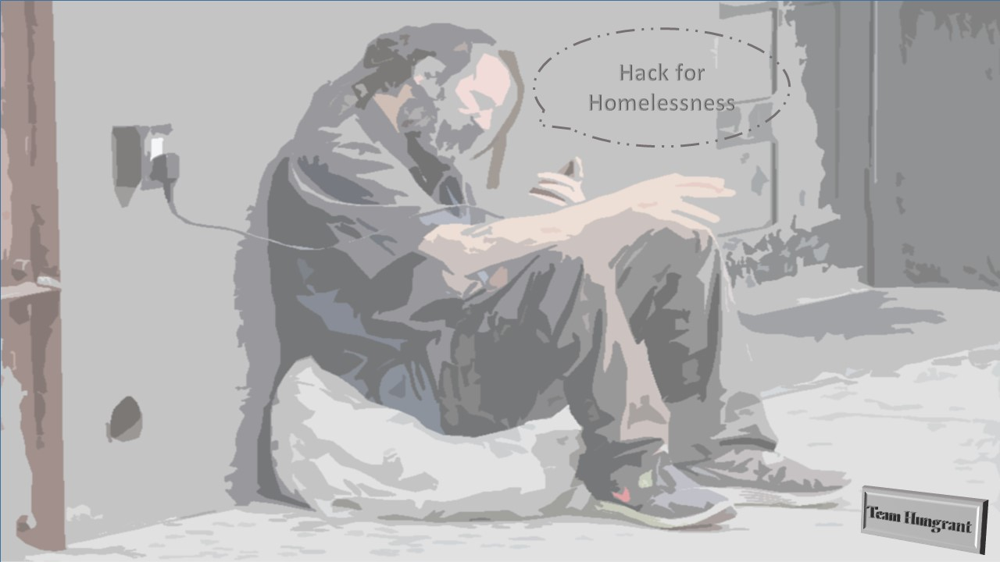

# Hacking Homelessness

This is a submission project for [Hacking Homelessness](https://www.hackerearth.com/challenges/hackathon/hacking-homelessness/). The submssion is made under the category: **Contributing for a change**. Currently the mobile app and web UI interface focuses to provide with the following features:

 - **Contribute User Option**: Allows any user to make a donation or come up with the ideas to improve this system.This is the idealogy behind the creation of a better community and making it accessible for citizens (which are the general app users) to contribute in terms of donations and ideas.
 - **NGOs Available**: This option allows to check for nearby NGOs and their campaigns regarding clothes distribution, shelter provisions etc. With the help of this a message can be added to these NGOs regarding homeless people around. This method will be effective in listing such organizations and spreading awareness among the general public and homeless people about the work of these organizations
 - **News Feed**: Here you can check daily posts and updates of how the app and you are collectively making a difference in this world by eradicating homelessness and serving to the world to make it a better place to live in.
 - **My reward Points**: This option is solely for the contributors. The point count keeps a check of all the activities and contributions made by individual users. Based on these contributions they would be offered with premium goodies and swags, that will motivate users too to contribute towards such a cause.
 - **Register a Homeless**: This option is available to track a homeless and report him through the app with his photograph and GPS location so the authorities can reach him and accordingly take actions to help him get a shelter and other services.
 - **Share your homeless Moment**: This option is about sharing the moments captured while being a part of NGO programme or spotting group of homeless people shivering in cold who need immediate help or things similar to that. Here you can also spread awareness about current programs so that others can be informed about your work.

## Architecture Description
The mobile application has been created using Flutter framework that enables cross platform development and hence allowing the same piece of code to be used for android, ios as well as web development. For the server end, JS is used to facilitate https requests and data exchange.

## Important note:
Kindly note that google-services.json file has been intentionally removed due to privacy purposes. and you need to generate your own json file and create firebase project to achieve firebase data storage. Although Apk is available for plug and play as you install it in your android phone it will work accordingly.
